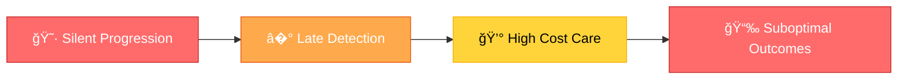
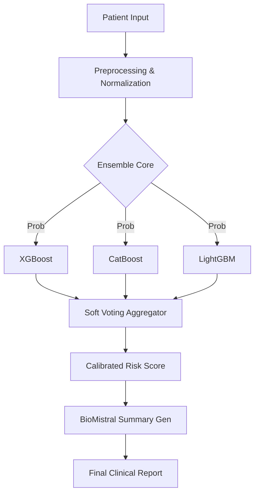

<div align="center">

# � ��������: �������� ���� ������������
### *Empowering Precision Medicine with SOTA Ensemble ML & Generative AI*

[](https://huggingface.co/spaces/purvansh01/astramed-backend)
[](https://clinical-risk-predictor-nine.vercel.app/)
[](LICENSE)
[](https://www.python.org/)

[**Explore Interactive App**](https://clinical-risk-predictor-nine.vercel.app/) • [**API Documentation**](https://huggingface.co/spaces/purvansh01/astramed-backend/docs) • [**Technical Specs**](#-the-machine-learning-engine)

---

**AstraMed** is a high-performance clinical decision support system (CDSS) designed to detect early risk signals for chronic diseases. By combining **Gradient Boosted Ensembles**, **Explainable AI (SHAP)**, and **BioMistral-7B**, AstraMed provides clinicians with actionable insights, personalized patient reports, and real-time "What-If" simulation capabilities.

</div>

---

## 📑 Table of Contents

- [� Live Platform](#-live-platform)
- [🧩 The Problem](#-the-problem)
- [�� System Architecture](#-system-architecture)
- [🚀 Platform Pillars](#-platform-pillars)
- [🧠 Intelligence Engine](#-intelligence-engine)
- [🛠� Technology Stack](#�-technology-stack)
- [📡 Deployment & Quickstart](#-deployment--quickstart)
- [🗺� Future Roadmap](#-future-roadmap)
- [📄 License](#-license)


## � Live Deployment

<div align="center">

| Component | Status | Stack | Link |
|:----------|:-------|:------|:-----|
| **Prediction Engine** | 🟢 **Online** | FastAPI + XGBoost/CatBoost | [**API Docs**](https://huggingface.co/spaces/purvansh01/astramed-backend/docs) |
| **ML Inference Node** | 🟢 **Online** | Python 3.10 | [**Model Spaces**](https://huggingface.co/spaces/purvansh01/astramed-backend) |
| **Frontend App** | 🟢 **Online** | React + TypeScript | [**Live App**](https://clinical-risk-predictor-nine.vercel.app/) |

> **Interactive Demo**: Visit the **API Docs** link to explore the Swagger documentation and test the model inference directly.

</div>

---

## 🧩 The Problem: Silent Disease Progression

Chronic diseases often develop without overt symptoms. By the time clinical markers are obvious, outcomes are often compromised and treatment costs skyrocket.

### � The Clinical Gap

<div align="center">



</div>

AstraMed bridges this gap by providing **Early Risk Intelligence** through a multi-modal assessment workflow that supports both the specialized clinician and the proactive patient.

<table>
<tr>
<td width="50%">
<h4>🔬 For Clinicians</h4>
<ul>
<li>📈 **Precision Scoring**: High-density risk quantification.</li>
<li>� **Feature Attribution**: What-if drivers ranked by SHAP.</li>
<li>📊 **Interpretability**: Visual justification for every decision.</li>
<li>💊 **Evidence-Based**: Recommendations rooted in clinical data.</li>
</ul>
</td>
<td width="50%">
<h4>👤 For Patients</h4>
<ul>
<li>🚦 **Risk Gauges**: Intuitive visual status reporting.</li>
<li>� **Natural Language**: Summaries by BioMistral-7B.</li>
<li>🥗 **Actionable Change**: Personalized lifestyle guidance.</li>
<li>📱 **Digital Twin**: Visualizing the "Healthy Me" future.</li>
</ul>
</td>
</tr>
</table>

---

## 💡 Solution Architecture

### �� System Design

<div align="center">


## 🚀 Platform Pillars

AstraMed is built on four core pillars that transform raw clinical data into actionable intelligence.

<table>
<tr>
<td width="50%">

#### 1�⃣ Intelligent Risk Stratification
- 📊 **Multi-Level Classification**: Automated sorting into Low / Medium / High risk tiers.
- 📈 **Confidence intervals**: Statistical uncertainty quantification for high-stakes decisions.
- 📉 **Longitudinal Trends**: Real-time tracking of risk velocity over patient history.

</td>
<td width="50%">

#### 2�⃣ Explainable AI (XAI)
- � **SHAP Interpretability**: Deep feature attribution for every individual prediction.
- 📊 **Force Plot Visuals**: Graphical explanation of "why" a score was generated.
- 📋 **Clinical Auditability**: Transparent decision logs for medical review.

</td>
</tr>
<tr>
<td width="50%">

#### 3�⃣ Generative Clinical Wisdom
- 🤖 **BioMistral-7B**: Medical-grade LLM used for synthesizing complex data.
- � **Dual-Mode Reports**: Automated technical summaries for doctors and plain-language for patients.
- 📄 **Exportable Insight**: One-click PDF generation for clinical records.

</td>
<td width="50%">

#### 4�⃣ Counterfactual "What-If" Engine
- �� **Scenario Simulation**: "What happens if HbA1c drops by 1.0?"
- 🔄 **Interactive Biometrics**: Real-time adjustment of patient vitals to see risk impact.
- � **Actionable Target Setting**: Identify the exact lifestyle changes that yield maximum risk reduction.

</td>
</tr>
</table>

---

## 🧠 Intelligence Engine

AstraMed leverages an enterprise-grade **Ensemble Learning Pipeline** designed for high-accuracy clinical environments.

### 🔬 The "Tri-Force" Ensemble
Instead of a single model, we use a **Soft-Voting Ensemble** of three state-of-the-art gradient boosting algorithms:
1.  **XGBoost**: Optimized for structured clinical data performance.
2.  **CatBoost**: Handles categorical features (gender, history) without information leakage.
3.  **LightGBM**: Provides extreme efficiency on large-scale population datasets.



---

## 🛠� Technology Stack

| Layer | Technology | Purpose |
|:------|:-----------|:--------|
| **Core UI** | React 18 + TypeScript | Type-safe, high-performance interface |
| **Styling** | Tailwind CSS | Modern Glassmorphism 2.0 design system |
| **API** | FastAPI (Python) | Asynchronous, high-throughput REST service |
| **ML Engine** | XGBoost + CatBoost + LightGBM | Multi-model ensemble prediction |
| **XAI** | SHAP | Mathematical feature attribution |
| **GenAI** | BioMistral-7B (LLM) | Medical-grade report synthesis |
| **DevOps** | Docker + Docker Compose | Containerized microservice delivery |

---

## 📡 Deployment & Quickstart

### � Run with Docker (Recommended)
The fastest way to get AstraMed running locally is via Docker Compose:

```bash
git clone https://github.com/purvanshjoshi/clinical-risk-predictor.git
cd clinical-risk-predictor
docker-compose up --build
```
*Access the UI at `http://localhost:3000` and API Docs at `http://localhost:8001/docs`.*

### � Manual Backend Setup
```bash
cd backend
python -m venv venv
source venv/bin/activate  # Windows: venv\Scripts\activate
pip install -r requirements.txt
uvicorn backend.api:app --reload --port 8001
```

---

## 📦 Project Structure

```text
clinical-risk-predictor/
├── � backend/          # FastAPI Server & ML Models
│   ├── � models/       # Inference engines (Risk, SHAP, LLM)
│   └── � routes/       # API endpoints (Predict, Stream, Auth)
├── � frontend/         # React (Vite) Application
│   ├── � src/components/ # UI Components (Dashboard, Simulation, LLM)
│   └── � src/api/      # Axios client wrappers
├── � ml-research/      # Training notebooks & evaluation scripts
└── � Dockerfile        # Multi-stage production builds
```

---

## 🗺� Future Roadmap

- [ ] **FHIR Integration**: Native support for HL7 FHIR data standards.
- [ ] **Federated Learning**: Privacy-preserving model training across hospitals.
- [ ] **Computer Vision**: Integration of medical imaging (X-ray/MRI) into the risk ensemble.
- [ ] **Mobile App**: Cross-platform patient portal for real-time health tracking.

---

## 📄 License

Distributed under the MIT License. See `LICENSE` for more information.

<div align="center">

**Ready to transform clinical decision making?**  
[Star on GitHub](https://github.com/purvanshjoshi/clinical-risk-predictor) • [Report Bug](https://github.com/purvanshjoshi/clinical-risk-predictor/issues) • [Request Feature](https://github.com/purvanshjoshi/clinical-risk-predictor/issues)

</div>
”€ 📓 02_Modeling.ipynb    # Model development
│   │   └── 📓 03_Evaluation.ipynb  # Performance analysis
│   │
│   └── � experiments/             # Experiment Logs
│       └── 📄 model_metrics.json
│
├── � data/                        # Datasets
│   ├── 📊 diabetes_dataset.csv     # Training data (provided)
│   ├── 📊 synthetic_patients.csv   # Test data
│   └── 📊 population_stats.json    # Cohort statistics
│
├── � docs/                        # Documentation
│   ├── 📄 ARCHITECTURE.md          # System design details
│   ├── 📄 API_SPEC.md              # API documentation
│   ├── 📄 MODEL_CARD.md            # Model specifications
│   ├── 📄 ETHICS_AND_LIMITATIONS.md # Safety considerations
│   ├── 📄 TEAM_ROLES.md            # Team structure
│   ├── 📄 TIMELINE.md              # Sprint planning
│   └── 📄 DEPLOYMENT.md            # Deployment guide
│
├── � .github/                     # GitHub Configuration
│   └── � workflows/
│       ├── 📄 backend-tests.yml    # Backend CI/CD
│       └── 📄 frontend-tests.yml   # Frontend CI/CD
│
├── 📄 docker-compose.yml           # Multi-container setup
├── 📄 .gitignore                   # Git ignore rules
├── 📄 README.md                    # This file
├── 📄 CONTRIBUTING.md              # Contribution guidelines
└── 📄 LICENSE                      # MIT License

```

---

## 📊 Expected Deliverables

<div align="center">

### � Final Showcase Outputs

</div>

<table>
<tr>
<td width="50%">

#### 📦 1. Public GitHub Repository

**Complete Source Code with Documentation**

- ✅ Well-organized file structure
- ✅ Comprehensive README.md
- ✅ Code comments and docstrings
- ✅ Architectural diagrams
- ✅ API documentation (OpenAPI)
- ✅ Version control history

**Repository Link**: [GitHub.com/YourTeam/clinical-risk-predictor](https://github.com)

</td>
<td width="50%">

#### 💻 2. Working Prototype

**Full-Stack Application Demo**

- ✅ FastAPI backend (deployed)
- ✅ React frontend (deployed)
- ✅ Clinician dashboard interface
- ✅ Patient portal interface
- ✅ Real-time risk predictions
- ✅ Interactive visualizations

**Live Demo**: [app.clinical-risk.demo](https://demo.com)

</td>
</tr>
<tr>
<td width="50%">

#### � 3. Demo Video

**5-7 Minute Walkthrough**

- ✅ Problem statement explanation
- ✅ Solution architecture overview
- ✅ Live feature demonstration
- ✅ Key technical insights
- ✅ Impact and use cases
- ✅ Future roadmap

**Video Link**: [YouTube/Product-Demo](https://youtube.com)

</td>
<td width="50%">

#### 📚 4. Comprehensive Documentation

**Technical & Clinical Documentation**

- ✅ **MODEL_CARD.md** — ML model details
- ✅ **ETHICS_AND_LIMITATIONS.md** — Safety analysis
- ✅ **ARCHITECTURE.md** — System design
- ✅ **API_SPEC.md** — Endpoint reference
- ✅ **DEPLOYMENT.md** — Setup guide
- ✅ Presentation slides (PDF)

</td>
</tr>
</table>


## 📚 Documentation

### 📖 Available Documentation

<table>
<tr>
<td align="center" width="33%">

#### �� Architecture

[](./docs/ARCHITECTURE.md)

System design, data flow, component interactions

</td>
<td align="center" width="33%">

#### 🔌 API Reference

[](./docs/API_SPEC.md)

Endpoint documentation, request/response schemas

</td>
<td align="center" width="33%">

#### 🤖 Model Card

[](./docs/MODEL_CARD.md)

ML model details, performance metrics

</td>
</tr>
<tr>
<td align="center" width="33%">

#### ⚖� Ethics & Safety

[](./docs/ETHICS_AND_LIMITATIONS.md)

Bias analysis, limitations, safety guidelines

</td>
<td align="center" width="33%">

#### 👥 Team Structure

[](./docs/TEAM_ROLES.md)

Detailed role breakdown, deliverables

</td>
<td align="center" width="33%">

#### 🚀 Deployment

[](./docs/DEPLOYMENT.md)

Production setup, Docker guide

</td>
</tr>
</table>

---


## 📄 License

<div align="center">

[](LICENSE)

**MIT License** — See [LICENSE](LICENSE) file for details


<p align="center">
  <strong>Ready to Transform Healthcare Through AI?</strong><br/>
  <a href="https://github.com">� Star this repository</a> •
  <a href="https://github.com">� Fork and contribute</a> •
  <a href="https://github.com">📧 Get in touch</a>
</p>

---

**Last Updated**: January 2025 | **Version**: 1.0.0 | **Status**: 🚧 In Active Development

</div>
