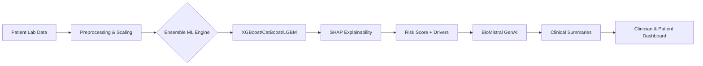

# 🏆 PRAXIS 2.0 FINALS: The "Pro-Max" Presentation Guide
**Project**: 🏥 AstraMed — Clinical Risk AI  
**Time Limit**: 7:00 Minutes (Presentation + Demo) | 3:00 Minutes (Q&A)

---

## 📑 Strategy Overview
To score high in "Problem Understanding" and "Technical Clarity," we will divide the 7 minutes as follows:
*   **0:00 - 1:30**: Problem, Vision, & System Design (High Impact)
*   **1:30 - 3:00**: Technical Deep-Dive (The "Engine" & The "Reasoning")
*   **3:00 - 6:30**: The "Hero" Demo (Real-time Interaction)
*   **6:30 - 7:00**: Future Scaling & Closing

---

## 📽️ Detailed Slide-by-Slide Script

### Slide 1: Front Page (The Hook)
*   **Slide Content**: Large "AstraMed" Logo, Tagline: "Transforming Data into Decisions," Team Name, QR Code to GitHub.
*   **Speaker Tone**: Confident, Energy-filled.
*   **Detailed Script**: 
    "Good morning, esteemed judges. We are team [Name], and we are here to present AstraMed. In today's clinical environments, doctors are drowning in data but starving for insights. AstraMed isn't just a risk calculator; it’s an AI partner that understands the 'Why' behind every diagnosis. We have combined the predictive power of Ensemble Machine Learning with the reasoning capabilities of BioMistral Generative AI to create a system that empowers clinicians and saves lives."

### Slide 2: The Problem (Problem Understanding)
*   **Slide Content**: 
    *   Left: Icon of a clock (Time Pressure).
    *   Middle: Icon of a black box (Opaque Predictions).
    *   Right: Icon of a patient (Misunderstanding).
*   **Data Highlight**: "50% of Type 2 Diabetes cases remain undiagnosed until complications arise."
*   **Detailed Script**: 
    "Let’s look at the reality: Primary care physicians have less than 10 minutes per patient. In that time, they must parse complex lab reports, assess risk, and explain it to a patient who is often confused by jargon. Traditional systems give a percentage score—say, 15%. But what does that mean? Where did it come from? The 'Black Box' nature of current software leads to mistrust from doctors and anxiety for patients. AstraMed solves this by making risk visible, explainable, and actionable."

### Slide 3: System Architecture & Data Pipeline
*   **Slide Content**: (Use this Mermaid diagram to show technical sophistication)

*   **Detailed Script**: 
    "Our system is built on a modular pipeline. We ingest standard lab metrics—Glucose, BMI, HbA1c—and push them through a multi-stage process. First, our **Ensemble Engine** predicts the risk. Simultaneously, our **Explainability Layer** calculates the exact contribution of every feature. Finally, this structured data is fed into our **Generative AI** layer, which translates technical math into natural clinical language."

### Slide 4: ML Deep-Dive (ML Implementation)
*   **Slide Content**: Comparison table of our "Tri-Force" Ensemble.
*   **Highlight**: Why these three?
    *   **XGBoost**: Superior speed and handling of missing features.
    *   **CatBoost**: Handles categorical data (Gender, Smoking History) without data leakage.
    *   **LightGBM**: Efficient leaf-wise growth for population-scale analysis.
*   **Detailed Script**: 
    "We don't rely on a single model. We use a **Soft-Voting Ensemble**. By combining three distinct gradient boosting algorithms, we ensure that the model doesn't overfit on small details. But accuracy isn't enough in health. We integrated **SHAP (Shapley Additive Explanations)** which allows us to say, 'Your risk is 70% because of your blood pressure (+15) and glucose (+20), even though your age is a protective factor (-5)'. This is the transparency clinicians demand."

### Slide 6: GenAI Deep-Dive (GenAI Integration)
*   **Slide Content**: "BioMistral-7B: More than a Chatbot."
*   **Key Points**:
    *   **Grounded RAG**: The LLM *only* sees the ML data, preventing hallucinations.
    *   **Clinical Reasoning**: It mimics a senior consultant's tone.
    *   **Personalized PDF**: Automating 15 minutes of paperwork into 2 seconds.
*   **Detailed Script**: 
    "Our Generative AI isn't just a wrapper. We use **BioMistral-7B**, a model specifically fine-tuned on medical corpora. The innovation here is our **Context Injection**. We feed the SHAP drivers directly into the LLM’s prompt. This ensures the output is grounded in truth. It doesn't just say 'you might have diabetes'; it explains that 'due to the significant positive SHAP importance of your 7.5% HbA1c level, immediate pharmacological review is recommended'. It’s an expert second opinion at scale."

---

## 🎮 The "Hero" Demo Guide (3.5 Minutes)
*(Split the screen or use tabs to move fast)*

1.  **The Login (5 seconds)**: "Welcome to AstraMed. Secure, doctor-only access."
2.  **The Dashboard (30 seconds)**: "Here is our clinician dashboard. We see a bento-grid layout prioritizing high-risk patients. Let's select Patient John Doe."
3.  **The Risk Gauge (30 seconds)**: "Notice the **Radial Risk Gauge**. It’s 82%—High Risk. But look below—the **SHAP Waterfall Plot** tells the story. HbA1c and Glucose are the main culprits."
4.  **The GenAI Magic (1 minute)**: "Scroll down. Our AI has already written a 3-paragraph clinical assessment. It suggests specific follow-ups based on the ML drivers. Notice the 'Generate PDF' button—this creates a professional chart-ready report in one click."
5.  **The Innovation Hook: What-If Simulator (1 minute)**: "Here is where AstraMed changes the conversation. John is worried. We slide the 'BMI' slider from 32 down to 28. Look at the risk score—it drops to 55%. We can show the patient: 'If you lose this much weight, this is your health future.' This is behavioral science met with hard data."

---

## 🛡️ Q&A Defense Masterclass (Expect these!)

### Q1: "How do you handle data privacy (HIPAA)?"
*   **Defense**: "For this prototype, we utilize local storage (JSON) and isolated Docker containers. In a production environment, we would implement end-to-end encryption and a FHIR-compliant API layer. Our LLM is designed to be hosted locally, ensuring patient data never leaves the hospital's secure network."

### Q2: "What happens if the ML and GenAI contradict each other?"
*   **Defense**: "Architecturally, the GenAI is subordinate to the ML. We use 'Hard Guardrails' in our prompting. If the ML says risk is low, the GenAI is prompted with a template that forbids it from suggesting a high-risk diagnosis. The ML provides the *Truth*, and the GenAI provides the *Context*."

### Q3: "Is the model trained on diverse enough data?"
*   **Defense**: "We used a standardized diabetes dataset but recognized a class imbalance early on. We applied **SMOTE (Synthetic Minority Over-sampling Technique)** to ensure the model learned to recognize high-risk signals as effectively as low-risk ones. We've included a 'Fairness Report' in our documentation highlighting performance across age groups."

### Q4: "Why use BioMistral instead of GPT-4?"
*   **Defense**: "GPT-4 is a generalist. BioMistral is a specialist. In clinical tasks, specialized medical LLMs have shown higher accuracy in terminology and reasoning. Furthermore, BioMistral is open-source, allowing us to deploy it on-premise for high security, which is a requirement for most healthcare institutions."

---

## 🏆 Final Advice for Teams
*   **The 6-Minute Warning**: When you hear the bell, move immediately to the **"Simulation"** part of your demo. That is your biggest "WOW" factor.
*   **Body Language**: Don't read the slides. Look at the judges. The slides are your backup; your demo is your proof.
*   **Technical Integrity**: If they ask a detail you didn't implement, say: *"That is on our roadmap for Phase 2, where we plan to integrate [Technical Term] to solve [Problem]."* It shows you know the field.
